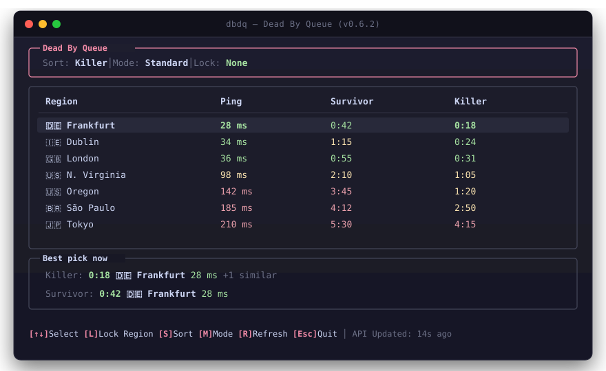

# Dead By Queue (`dbdq`)

[](https://github.com/trazxdxne/dbdqueue/releases)
[](https://github.com/trazxdxne/dbdqueue/actions)
[](LICENSE)
[](https://www.rust-lang.org/)
[](https://github.com/trazxdxne/dbdqueue/releases)

<p align="center">
  <b>Language / Язык:</b>&nbsp;
  <kbd><b>English</b></kbd>&nbsp;•&nbsp;<a href="README.ru.md"><kbd>Русский</kbd></a>
</p>

> [!IMPORTANT]
> **Legal Notice & Trademark Disclaimer**
> Dead By Queue is an independent, community-developed open-source utility utilizing the public `deadbyqueue.com` API. It is **not affiliated with, endorsed by, sponsored by, or partnered with** Behaviour Interactive Inc., Amazon Web Services, Inc. (AWS), or `deadbyqueue.com`.
> *"Dead by Daylight"* is a registered trademark of Behaviour Interactive Inc. *"AWS"* and related marks are trademarks of Amazon.com, Inc. or its affiliates. All regional routing controls modify local OS network resolution only. See [LICENSE](LICENSE) for full legal terms and limitation of liability.

---

A fast, zero-dependency native terminal dashboard (TUI) for Dead by Daylight players. Dead By Queue displays live matchmaking queue times and server latencies across all global AWS datacenters, features an intelligent role-aware recommendation engine, and empowers players with integrated region locking to eliminate high-ping or undesirable matchmaking pools.

<p align="center">
  
</p>

---

## Features

### Real-Time Ratatui Terminal Interface
- **Pure Native Performance**: Written entirely in Rust with `ratatui` and `crossterm`—no Node.js, Electron, or external runtime required.
- **Adaptive Layout**: Automatically centers tables and guarantees that the **Best Pick** panel, header, and footer controls remain fully visible on standard $80 \times 24$ (and $\ge 14$) viewports with smooth table row scrolling.
- **Intuitive Time Formatting**: Matchmaking durations are presented as `Xs` ($<60$s), `m:ss` ($1$:00 to $59$:59), and `1h+` / `2h+` ($\ge 1$h), stabilizing column alignment and eliminating cramped letter strings.
- **Accurate Refresh Timestamps**: Shows the exact age of source data from the API rather than just local poll times.

### Role-Aware Recommendation Engine ("Best Pick")
Instead of naively selecting the shortest queue time, `dbdq` computes a role-sensitive composite score balancing queue wait times against network latency:

$$\text{Score} = \text{Wait Time (seconds)} + \text{Latency Penalty}(\text{Ping}, \text{Role})$$

- **Role-Specific Latency Penalties**:
  - **Killers** (host-authoritative hit validation): Penalties apply gradually above $70\text{ ms}$, escalating sharply only beyond $140\text{ ms}$.
  - **Survivors** (tight reaction windows for fast vaults and skill checks): Latency penalties begin scaling earlier at $60\text{ ms}$, with heavy penalties above $90\text{ ms}$.
- **`+N similar` Detection**: Indicates when alternative regions offer comparable performance within $\pm 25\text{ ms}$ latency and $\pm 15\text{ s}$ queue duration.
- **Data Integrity**: Unmeasured ping regions and disabled game servers are automatically excluded from recommendation scoring.

### AWS Matchmaking Region Locker
- **Local Firewall & Routing Filter**: Whitelist your preferred server regions (`l` in TUI or `dbdq lock [regions]`) while blocking undesirable remote regions.
- **Dedicated Interactive CLI Menu**: Running `dbdq lock` opens a flicker-free Ratatui modal on the alternate screen buffer with smooth keyboard navigation and scrolling, leaving the terminal completely clean upon exit.
- **Zero In-Game Overhead**: Operates entirely through OS-level hosts routing—no packet injection, memory tampering, or VPN overhead.
- **Non-Blocking Elevation**: Administrative/UAC elevation prompts execute off the main event loop so the UI remains fluid and responsive.

### Non-Blocking Background Refresh
- **Parallel Network Workers**: Background threads fetch queue times and measure 1-RTT HTTP/1.1 Keep-Alive ping probes without blocking the interactive UI.
- **Live Visual Feedback**: Features an animated braille spinner (`⠋ Fetching...`) in the status bar during refresh cycles and auto-expiring status confirmations (`[✓ Updated]`).

### Multi-Layout Keyboard Support
- Fully functional across international keyboard layouts. All shortcuts seamlessly operate on Latin, Cyrillic (Russian), and other layouts without requiring layout switching.

### Persistent Dual-Platform Configuration
- Preferences (sorting mode, active game mode, locked regions) automatically persist across sessions:
  - **Linux**: `~/.config/dbdqueue/config.toml`
  - **Windows**: `%APPDATA%\dbdqueue\config.toml`

---

## Installation & Quick Start

### Windows (PowerShell)
Install and launch `dbdq` with a single command:
```powershell
irm https://raw.githubusercontent.com/trazxdxne/dbdqueue/master/install.ps1 | iex
```
*Downloads the latest release binary into `%LOCALAPPDATA%\Programs\dbdqueue`, configures your user `PATH`, and launches the dashboard.*

### Linux (Bash)
Install and launch `dbdq` with a single command:
```bash
curl -fsSL https://raw.githubusercontent.com/trazxdxne/dbdqueue/master/install.sh | bash
```
*Detects your system architecture (`x86_64` or `aarch64`), installs the binary to `/usr/local/bin` (or `~/.local/bin`), and starts the dashboard.*

---

## Pre-Built Binaries & Archives

Release archives and standalone binaries are available on the [GitHub Releases](https://github.com/trazxdxne/dbdqueue/releases) page:

| Platform | Architecture | Distribution Archive | Standalone Binary |
| :--- | :--- | :--- | :--- |
| **Linux** | `x86_64` | `dbdq-linux-x86_64.tar.gz` | `dbdq-linux-x86_64` |
| **Linux** | `aarch64` | `dbdq-linux-aarch64.tar.gz` | `dbdq-linux-aarch64` |
| **Windows** | `x64` | `dbdq-windows-x64.zip` | `dbdq-windows-x64.exe` |

### Integrity Verification
Every release includes an official `SHA256SUMS.txt` file containing cryptographic checksums for all distribution assets. To verify your download:

**Linux / macOS:**
```bash
sha256sum -c SHA256SUMS.txt --ignore-missing
```

**Windows (PowerShell):**
```powershell
Get-FileHash -Algorithm SHA256 dbdq-windows-x64.zip
```

---

## Build from Source

Ensure you have the latest stable Rust toolchain installed (`rustup update`).

```bash
# Clone the repository
git clone https://github.com/trazxdxne/dbdqueue.git
cd dbdqueue

# Build optimized release binary
cargo build --release

# The compiled binary will be located at:
# Linux:   target/release/dbdq
# Windows: target\release\dbdq.exe
```

Or install directly into your Cargo bin directory:
```bash
cargo install --path .
```

---

## Usage

Launch the interactive dashboard:
```bash
dbdq
```

### Keyboard Shortcuts

| Key | Action |
| :--- | :--- |
| `↑` / `↓` | Select / scroll table rows |
| `l` | Open **Region Locker** modal |
| `s` | Cycle sorting mode (`Killer` → `Survivor` → `Ping`) |
| `m` | Toggle game mode filter (`Standard` ↔ `Event`) |
| `r` | Trigger immediate background data & ping refresh |
| `Esc` | Close modal dialog or quit application |

### CLI Subcommands & Flags

You can bypass the TUI or preset initial options directly from the command line:

```bash
# Launch with specific initial sorting
dbdq --sort ping
dbdq --sort killer
dbdq --sort survivor

# Filter by matchmaking mode
dbdq --mode standard
dbdq --mode event

# Lock to specific AWS regions (blocks all other matchmaking regions)
dbdq lock frankfurt dublin

# Interactive CLI region locking menu
dbdq lock

# Revert all region locks and restore default matchmaking
dbdq unlock
```

---

## Configuration

Settings are saved in TOML format:

```toml
mode = "Standard"       # "Standard" or "Event"
sort = "Killer"         # "Killer", "Survivor", "Ping", or "Default"
locked = ["eu-central-1"] # Whitelisted AWS region codes
lang = "auto"           # "auto", "en", or "ru"
```

- **Linux**: `~/.config/dbdqueue/config.toml`
- **Windows**: `%APPDATA%\dbdqueue\config.toml`

Environment variables are also supported:
- `DBD_API_URL`: Override API endpoint with a custom mirror.
- `HTTP_PROXY` / `HTTPS_PROXY`: Standard HTTP/HTTPS proxy routing.

---

## Specifications

- **Language**: 100% Rust (2024 Edition)
- **TUI Framework**: `ratatui` (v0.30+) & `crossterm` (v0.27+)
- **HTTP Client**: `ureq` (v2.9+) with TLS connection pooling
- **CLI Engine**: `clap` (v4.4+) with derive macros
- **Serialization**: `serde` & `serde_json`, `toml`
- **Supported Operating Systems**: Linux (x86_64, aarch64), Windows (x64)

---

<p align="center">
  <a href="README.ru.md">Читать на русском языке (README.ru.md)</a>
</p>

